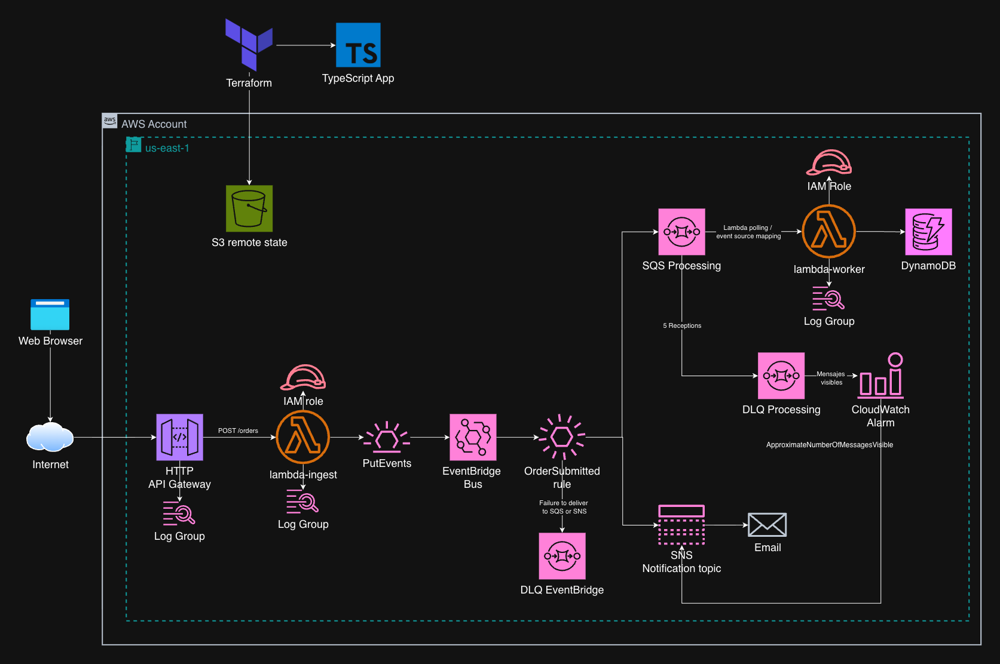

# Pedidos serverless en AWS con TypeScript y Terraform

Proyecto de aprendizaje para recibir pedidos por HTTP y procesarlos de forma asíncrona en AWS. Terraform crea la infraestructura; dos funciones Lambda escritas en TypeScript validan los pedidos y los guardan en DynamoDB.

- **Aplicación:** Lambda `ingest` recibe el pedido y Lambda `worker` lo guarda.
- **Infraestructura:** API Gateway, EventBridge, SQS, SNS, DynamoDB, IAM y CloudWatch.

## Arquitectura

<p align="center">
  
</p>

```text
POST /orders → API Gateway → Lambda ingest → EventBridge
                                             ├─→ SQS processing → Lambda worker → DynamoDB
                                             └─→ SNS → correo
```

1. `ingest` valida el JSON y publica un evento `OrderSubmitted`.
2. EventBridge entrega el evento a la cola de procesamiento y al tema de notificaciones.
3. `worker` consume la cola y escribe el pedido en DynamoDB.
4. Si falla la entrega de EventBridge, el evento va a `eventbridge_dlq`. Si falla repetidamente el procesamiento, el mensaje va a `processing_dlq` y se activa una alarma de CloudWatch.

> [!IMPORTANT]
> Por asincronía, La respuesta HTTP `202` confirma que EventBridge aceptó el evento. No confirma que el pedido ya esté guardado en DynamoDB. El correo y la escritura son destinos independientes.

## Estructura del repositorio

```text
.
├── app/
│   ├── src/ingest/index.ts       Validación y publicación del evento
│   ├── src/worker/index.ts       Consumo de SQS y escritura en DynamoDB
│   ├── package.json              Dependencias y comandos de compilación
│   └── pnpm-lock.yaml
├── docs/architecture.png         Diagrama de arquitectura
├── api.tf                        HTTP API y ruta POST /orders
├── lambda.tf                     Funciones, paquetes y disparador SQS
├── eventbridge.tf                Bus, regla y destinos
├── sqs.tf                        Colas de procesamiento y errores
├── sns.tf                        Tema y suscripción de correo
├── dynamodb.tf                   Tabla de pedidos
├── iam.tf                        Roles y permisos
├── observability.tf              Logs y alarma
├── backend.tf                    Estado remoto en S3
├── variables.tf                  Correo de notificaciones
├── outputs.tf                    URL de la API, tabla y cola
└── terraform.tfvars.example      Ejemplo de configuración local
```

`app/build/` se genera al compilar. `app/node_modules/`, `app/build/`, `.terraform/` y `terraform.tfvars` están ignorados por Git. El archivo `.terraform.lock.hcl` fija las versiones de los proveedores y debe conservarse en el repositorio.

## API

Solo existe una ruta: `POST /orders`. Acepta un objeto JSON como este:

```json
{
  "orderId": "pedido-001",
  "customerEmail": "cliente@example.com",
  "amount": "49.90"
}
```

| Campo           | Validación                                                         |
| --------------- | ------------------------------------------------------------------ |
| `orderId`       | De 1 a 64 letras ASCII, números, guiones o guiones bajos.          |
| `customerEmail` | Debe contener `@` y tener como máximo 320 caracteres.              |
| `amount`        | Cadena decimal mayor que 0 y menor o igual a 1 000 000.             |

El cuerpo no puede superar 64 KiB. Si el evento se publica correctamente, la API devuelve `202`:

```json
{
  "message": "Order accepted for processing",
  "orderId": "pedido-001",
  "requestId": "identificador-de-la-peticion"
}
```

Los datos inválidos producen `400`; un fallo al publicar el evento produce `500`. El correo de SNS se envía a `notification_email`, configurado para el despliegue; `customerEmail` se guarda como dato del pedido y no determina el destinatario de esa notificación.

## Entorno y estado de Terraform

Esta configuración despliega un único entorno, `dev`, en `us-east-1`. Los recursos usan el prefijo `lambda-serverless-dev` y etiquetas de proyecto, entorno y administración.

El estado se guarda en un bucket S3 **que ya debe existir**. Su nombre se pasa a `terraform init`; el backend activa el cifrado y el bloqueo nativo de S3. La clave del objeto es:

```text
lambda-serverless/dev/statefile.tfstate
```

| Entrada o salida       | Uso                                                       |
| ---------------------- | --------------------------------------------------------- |
| `notification_email`   | Variable de entrada para la suscripción de correo de SNS. |
| `orders_endpoint`      | URL completa de `POST /orders`.                           |
| `orders_table_name`    | Nombre de la tabla DynamoDB.                              |
| `processing_queue_url` | URL de la cola SQS de procesamiento.                      |

## Requisitos

- Cuenta de AWS y credenciales con AWS CLI con permisos para consultar y crear los recursos.
- Bucket S3 existente para el estado de Terraform.
- Terraform `>= 1.10, < 2.0`.
- Node.js 24 y pnpm 12.6.0 para compilar las Lambdas.
- Acceso a `notification_email` para confirmar la suscripción de SNS.

> [!NOTE]
> Los comandos siguientes se ejecutan desde la raíz del repositorio, salvo el bloque que entra en `app/`.

## Compilar la aplicación

```bash
cd app
pnpm install --frozen-lockfile
pnpm run build
cd ..
```

La compilación comprueba los tipos y crea `app/build/ingest/index.cjs` y `app/build/worker/index.cjs`. Terraform los empaqueta en archivos ZIP. **Compila antes de `terraform plan` o `terraform apply`**: Terraform utiliza esos archivos JavaScript, no el código TypeScript directamente.

## Desplegar desarrollo

### 1. Prepara la cuenta y las variables

Comprueba qué identidad AWS usarás:

```bash
aws sts get-caller-identity
```

Copia el ejemplo y reemplaza la dirección de correo:

```bash
cp terraform.tfvars.example terraform.tfvars
```

```hcl
notification_email = "tu-correo@example.com"
```

### 2. Inicializa y revisa Terraform

Indica el nombre de tu bucket S3 existente:

```bash
terraform init -backend-config="bucket=NOMBRE_DE_TU_BUCKET"
terraform fmt -recursive
terraform validate
terraform plan
```

### 3. Despliega

Cuando hayas revisado el plan, despliega:

```bash
terraform apply
```

Confirma la suscripción desde el correo que envía AWS a `notification_email`. Hasta entonces, SNS no entregará los correos de pedidos ni las alertas.

## Comprobar el funcionamiento

Envía un pedido a la URL creada por Terraform:

```bash
curl -i -X POST "$(terraform output -raw orders_endpoint)" \
  -H "Content-Type: application/json" \
  -d '{"orderId":"pedido-001","customerEmail":"cliente@example.com","amount":"49.90"}'
```

La respuesta debe ser `202`. Tras el procesamiento asíncrono, consulta el registro:

```bash
aws dynamodb get-item \
  --table-name "$(terraform output -raw orders_table_name)" \
  --key '{"orderId":{"S":"pedido-001"}}' \
  --region us-east-1
```

El registro contiene `orderId`, `customerEmail`, `amount`, `createdAt`, `processedAt`, `eventId` y el estado `RECEIVED`. Cambia `orderId` en cada prueba si quieres crear un registro nuevo. Comprueba también que llegó el correo de SNS.

Si el pedido tarda en aparecer, consulta los logs de `worker` y revisa la cola `lambda-serverless-dev-processing-dlq`:

## Procesamiento y fallos

| Etapa                   | Reintentos y destino de error                                                                                                                                                        |
| ----------------------- | ------------------------------------------------------------------------------------------------------------------------------------------------------------------------------------ |
| EventBridge → SQS o SNS | Hasta 185 intentos durante un máximo de 24 horas. Si no puede entregar el evento, lo envía a `eventbridge_dlq`.                                                                      |
| SQS → `worker`          | La cola tiene 60 segundos de visibilidad. `worker` informa los fallos por mensaje para reintentar solo los que fallaron; tras cinco recepciones, el mensaje pasa a `processing_dlq`. |

La cola de procesamiento retiene mensajes hasta 4 días; ambas DLQ los retienen hasta 14 días. Una alarma publica en SNS cuando hay al menos un mensaje visible en `processing_dlq`. `eventbridge_dlq` no tiene alarma. Las DLQ requieren inspección y recuperación manual; no hay reprocesamiento automático.

DynamoDB escribe un `orderId` solo si todavía no existe. Un pedido repetido no sobrescribe el registro, aunque la API puede responder `202` otra vez y SNS puede enviar otro correo. Los logs de API Gateway y las dos Lambdas se conservan durante 14 días.

## Seguridad aplicada

- `ingest` y `worker` tienen roles IAM separados y permisos limitados a sus tareas.
- Las políticas de SQS y SNS restringen la entrega de EventBridge a la regla de pedidos.
- Las colas SQS usan cifrado administrado por SQS; el estado remoto en S3 usa cifrado y bloqueo.
- API Gateway limita la ruta a 20 solicitudes por segundo y ráfagas de 40.
- `terraform.tfvars` se mantiene fuera de Git.

La ruta tiene `authorization_type = "NONE"`, por lo que cualquier cliente con la URL puede enviar pedidos. No hay configuración CORS para llamadas desde JavaScript en otro origen. El correo del cliente viaja por EventBridge y SQS, y se almacena en DynamoDB; restringe el acceso a esos recursos y al estado de Terraform.

## Costos principales

Mientras esté desplegado, este laboratorio puede generar cargos por API Gateway, Lambda, EventBridge, SQS, SNS, DynamoDB, CloudWatch y el bucket S3 del estado. DynamoDB usa facturación bajo demanda; el costo depende del uso real.

## Eliminar recursos

Revisa el plan de destrucción y después elimina los recursos:

```bash
terraform plan -destroy
terraform destroy
```

La destrucción elimina la tabla y las colas junto con sus datos y mensajes. El bucket S3 del estado se administra aparte y permanece.

## Límites actuales

- Solo existe `dev` en `us-east-1`; no hay configuración de producción.
- La API crea pedidos, pero no ofrece una ruta para consultarlos.
- No hay autenticación, CORS, pruebas automatizadas ni pipeline de despliegue.
- DynamoDB no tiene recuperación a un punto en el tiempo ni protección contra borrado.
- No hay alarma para `eventbridge_dlq` ni reprocesamiento automático de las DLQ.
